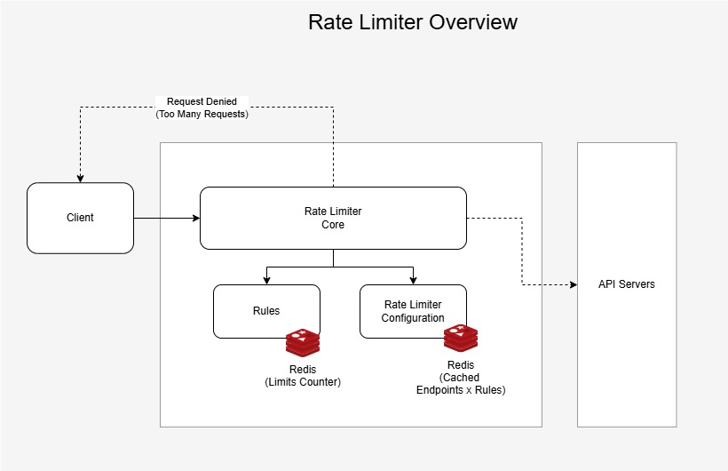

# Rate Limiter

## Overview

The Rate Limiter Service is designed to control the rate of requests to various endpoints in an application. It supports different rate limiting rules, such as limiting the number of requests per period and ensuring a minimum time since the last call. The service is highly configurable and can be integrated into any ASP.NET Core application.

It is composed by the following components:



## Rate Limiter Service Components


### Rate Limiter Core

The **RateLimiterService** class is the core component that handles rate limiting logic. It uses the pre-configured rules provided by the "Rules" component to determine whether a request should be allowed or denied. This component is the orchestrator of the Rate Limiter solution.
Methods

**Task<RateLimiterResult> InvokeAsync(HttpContext context)**: Evaluates the request based on the configured rules and returns a RateLimiterResult indicating whether the request is allowed.


### Rules

The Rules folder contains the base definition for the rate limiting rules and also some sample implementations.

***Rule Base Class and Contract***

- **RateLimiterRuleBase**: base class that provides the foundation for all rules.
- **IRateLimterRule**: An interface that defines the base contract for rate limiting rules.
- **IRateLimiterNotification**: Additional behavior that may or may not be implemented by the rules.

***Rules Sample Implementations***

Folder containing the concrete implementation of the rules. In a real scenario, the rules could be separate components, implemented in isolated Class Libraries that could be loaded via Reflection. In this example, only the **RequestsPerPeriodRule** rule has an implementation.

### Rate Limiter Configuration

The **ConfigurationStorageProvider** folder contains classes and interfaces that handle the storage and retrieval of rate limiter endpoints and rules configurations. This allows the rate limiter service to dynamically load and update its configuration from various storage providers, such as Redis and file storage.

*Configuration Provider Definition*

- **IConfigurationStorageProvider**: The IConfigurationStorageProvider interface defines the contract for a storage provider that can save and load rate limiter configurations.

For example:

```
/api/endpont1 --> Rule A
/api/endpont2 --> Rule B
/api/endpont3 --> Rule A and Rule B

```

- **ConfigurationProvider**: The ConfigurationProvider class is a high-level abstraction that uses an IConfigurationStorageProvider to save and load rate limiter configurations.

*Configuration Providers Implementation Samples*

- **RedisConfigurationStorage**: The RedisConfigurationStorage class is an implementation of the IConfigurationStorageProvider interface that uses Redis as the storage backend.
- **FileConfigurationStorage**: The FileConfigurationStorage class is an implementation of the IConfigurationStorageProvider interface that uses file storage as the backend.
